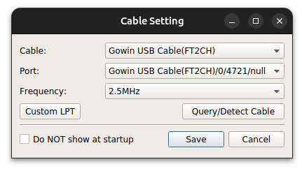
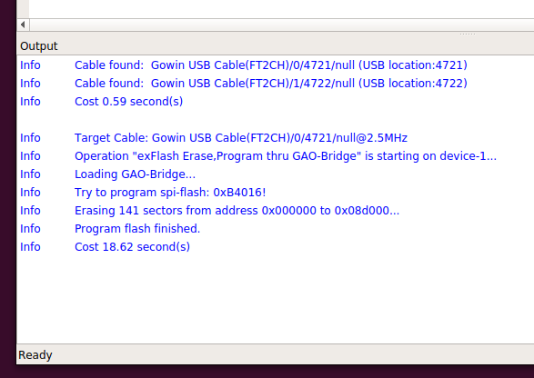

# Replacement for libftd2xx.so for GoWin Programmer

## Build:

> $ git clone ...\
> $ make

or use prebuilt `libftd2xx.so`

## Install:

* In directory `{your_install_path}/Programmer/bin` rename `libftd2xx.so` to `libftd2xx.so.real`
* Copy `libftd2xx.so` from this directory to `{your_install_path}/Programmer/bin`

## Notes:

* This is a not full implementation of `libftd2xx.so` but just a hack to fix some return values. So this library just "bridge" calls to real lib.
* Real library name `libftd2xx.so.real` is compiled in into binary. If you want to change it - change `config.h` and rebuild.

## How to check:

### Board SIPEED Tang Primer 20K

```
$ ./programmer_cli --scan-cables
 Cable found:  Gowin USB Cable(FT2CH)/0/4721/null (USB location:4721)
 Cable found:  Gowin USB Cable(FT2CH)/1/4722/null (USB location:4722)
 Cost 0.89 second(s)

$ ./programmer_cli --scan
 Scanning!
 Target Cable: Gowin USB Cable(FT2CH)/0/0/null@2.5MHz
Device Info:
 	Family: GW2ANR  
	Name: GW2A-18C GW2AR-18C GW2ANR-18C  (One of them)  
	ID: 0x0000081B  
 1 device(s) found!
 Cost 1.29 second(s)
```

### GUI Programmer Cable Settings



### GUI Programmer Log


